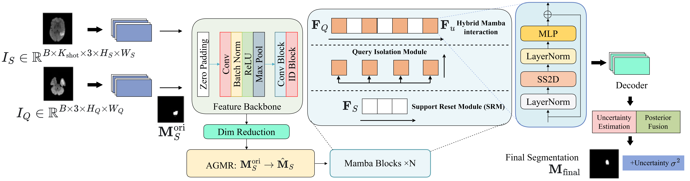
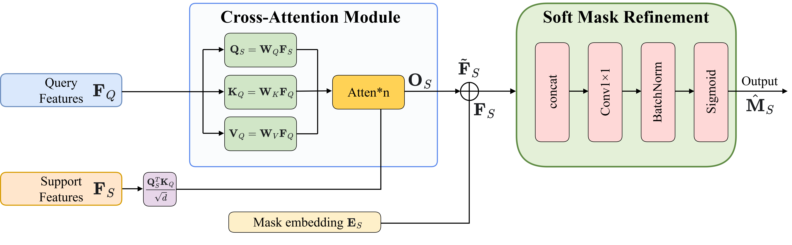
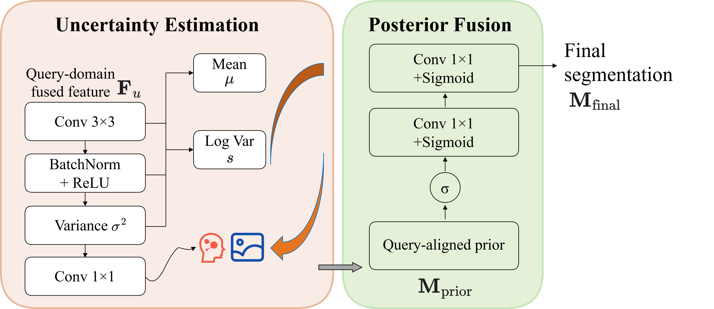
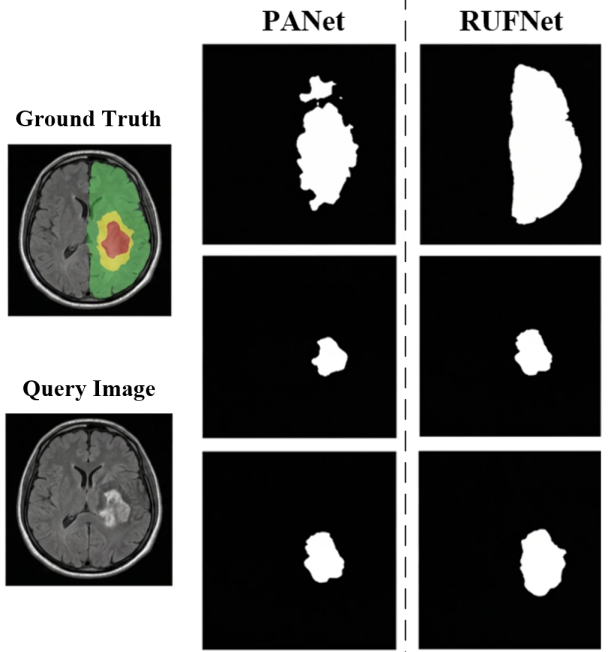
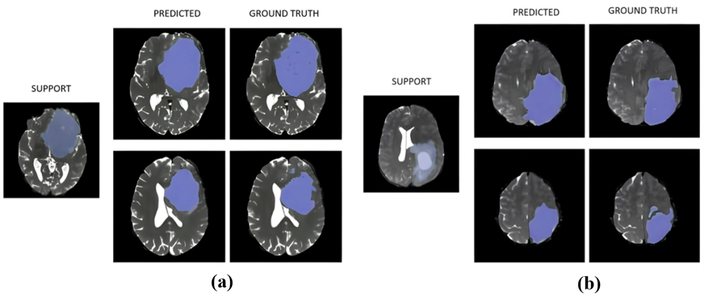

# RUFNet

Query-Guided Support Mask Refinement and Uncertainty Fusion for Few-Shot Brain Tumour Segmentation.

This repository is a reproducible PyTorch implementation package for **RUFNet**, a 1-way few-shot BraTS brain tumour segmentation framework. The model combines a standard `mamba-ssm` Hybrid Mamba interaction backbone, Attention-Guided Mask Refinement (AGMR), and Uncertainty-Aware Posterior Fusion (UAPF).

> Data and trained weights are not included. BraTS data must be obtained under the official challenge/data-use terms.

## Model



RUFNet follows three stages:

1. Shared PSP-style ResNet-50 encoder extracts support and query features.
2. AGMR uses query-support attention to refine noisy support masks.
3. Hybrid Mamba interaction models support-query dependencies, and UAPF fuses the meta prediction with a query-aligned prior using pixel-wise variance.

### AGMR



### UAPF



## Qualitative Results





## Performance Reported in the Paper

### Ablation on BraTS 2020

| Setting | Model Variant | DSC (%) ↑ | HD (mm) ↓ |
|---|---:|---:|---:|
| 1-way 1-shot | Baseline (no refine/fusion) | 82.7 | 12.34 |
| 1-way 1-shot | + AGMR only | 83.8 | 11.22 |
| 1-way 1-shot | + UAPF only | 83.1 | 11.90 |
| 1-way 1-shot | + AGMR + UAPF | **84.3** | **10.55** |
| 1-way 5-shot | Baseline | 84.5 | 9.14 |
| 1-way 5-shot | + AGMR only | 85.2 | 8.45 |
| 1-way 5-shot | + UAPF only | 85.0 | 8.73 |
| 1-way 5-shot | + AGMR + UAPF | **86.1** | **7.67** |

### Comparison on BraTS 2020

| Method | 1-shot DSC (%) ↑ | 1-shot HD (mm) ↓ | 5-shot DSC (%) ↑ | 5-shot HD (mm) ↓ |
|---|---:|---:|---:|---:|
| PANet | 29.43 ± 1.7 | 121.34 ± 23.6 | 33.96 ± 1.6 | 87.14 ± 13.6 |
| SENet | 36.21 ± 1.6 | 61.87 ± 11.5 | 45.27 ± 1.4 | 53.16 ± 12.5 |
| SSL-ALPNet | 61.89 ± 2.3 | 33.13 ± 9.5 | - | - |
| RPNet | 63.79 ± 1.8 | 28.76 ± 10.7 | - | - |
| AAS-DCL | 71.54 ± 1.3 | 15.01 ± 7.8 | 71.87 ± 0.8 | 14.47 ± 7.9 |
| SRCL | 74.23 ± 1.5 | 14.29 ± 8.8 | 76.14 ± 1.3 | 9.52 ± 7.4 |
| RegFSL | 75.18 ± 1.5 | **10.03 ± 8.2** | 77.16 ± 1.6 | 8.79 ± 6.7 |
| **RUFNet** | **84.3 ± 1.2** | 10.55 ± 2.4 | **86.1 ± 0.3** | **7.67 ± 3.5** |

## Authors

Dongyi He, Xiangkai Wang, Binbing Xu, Bin Jiang, Hongjie Yan, Weixiang Liu, Wai Ting Siok, and Nizhuan Wang.

Corresponding author: Nizhuan Wang.

## Funding

This research was funded by the Natural Science Foundation of Chongqing (CSTB2025NSCQ-JM002, CSTB2025NSCQ-GPX0794, CSTB2024NSCQ-MSX0118), Scientific and Technological Research Program of the Chongqing Education Commission (KJZD-K202303103, KJZD-K202501107, KJQN202501104), Chongqing Municipal Key Project for Technology Innovation and Application Development (CSTB2024TIAD-KPX0042, CSTB2025TIAD-KPX0002), an internal grant from The Hong Kong Polytechnic University (P0048377), The Hong Kong Polytechnic University Departmental Collaborative Research Fund (P0056428), The Hong Kong Polytechnic University Collaborative Research with World-leading Research Groups Fund (P0058097), and Research Grants Council Collaborative Research Fund (C5033-24G).

## Citation

```bibtex
@inproceedings{he2026rufnet,
  title = {RUFNet: Query-Guided Support Mask Refinement and Uncertainty Fusion for Few-Shot Brain Tumor Segmentation},
  author = {He, Dongyi and Wang, Xiangkai and Xu, Binbing and Jiang, Bin and Yan, Hongjie and Liu, Weixiang and Siok, Wai Ting and Wang, Nizhuan},
  year = {2026}
}
```

## Notes

This package is a research reproduction scaffold. Reaching the reported numbers requires the same BraTS access, patient split policy, hardware scale, preprocessing, and training budget described above.

